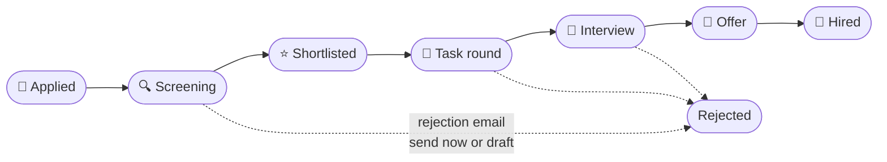

<div align="center">


**End-to-end hiring pipeline for Finquo Junior** — replaces the old
Meta-forms + WhatsApp + Excel workflow with one system: candidates apply and
track their application online; the team manages the entire funnel from
screening to hire.

[](https://nextjs.org)
[](https://react.dev)
[](https://www.postgresql.org)
[](https://www.typescriptlang.org)
[](https://vercel.com)

Live at **[hiring.finquojunior.com](https://hiring.finquojunior.com)**

</div>

---

## The pipeline



Every stage transition emails the candidate automatically — received,
shortlisted, task instructions, interview invite + calendar file, reminders,
offer, hired, rejection.

## What it does

**Candidates** (`/careers`, no account needed)
- Careers site with role posters, salary/location details, and rich-text
  descriptions; per-role links for ad campaigns (UTM source tracking built in)
- Fully customizable multi-step application forms: 12 field types (incl.
  salary in ₹), conditional logic, per-answer scoring, required consent
- Private tokenized portal: track status, book interview slots, submit task
  work (per-requirement slots — files up to 16 MB uploaded straight to storage,
  links, one submit for everything), download the task brief, withdraw — with
  toast confirmations on every action

**Staff** (`/login` → `/app`, role-based: admin / hr / dept head / interviewer)
- Dashboard: stat strip (active, interviews, offers, hires), today's
  interviews, new applications, pending feedback, task-round progress,
  stuck-candidate alerts, per-role stage funnels
- Pipeline per opening: list + drag-and-drop board views, bulk stage moves
  with select-all/shift-click ranges and progress feedback, filters, sorting,
  feedback stars, prev/next candidate navigation, CSV export
- Tasks: per-opening task brief (text + reference links + document), defined
  submission requirements (title, file/link kind, required flag), and
  per-candidate submitted/pending tracking — plus a global Tasks overview
- Candidate profiles: answers, inline resume preview, every asked-for task
  item with its submissions, star-rated feedback, notes, tags, timeline of
  every event and email
- Interview scheduling: slot batches with meeting links and multi-person
  panels; everyone involved gets emailed; feedback nudges after interviews
- Form builder with live preview, versioning (applications keep the form they
  answered), and question reuse across openings
- Manual add-candidate + CSV import for walk-ins/referrals
- Rejections: "Reject + email now" or "Reject + draft email" (drafts sit in
  the Emails tab until sent manually)
- Emails: full outbox with per-mail service badge, drafts, cancel, and manual
  resend via either service for failures
- Dual mail service: Resend primary with Gmail/Workspace SMTP fallback (app
  password) — selected in Settings; failed sends retry immediately and fall
  back to the other service automatically
- Reports: stage-conversion funnel, source performance, applications-per-week
  trend graph, interview feedback by role, activity feed, time-to-hire, and a
  print-ready hiring report (per role, month, or custom range) with a
  Download PDF button
- Admin: staff management, editable email templates, error log, full activity
  log, per-opening archive download (zip) and guarded permanent deletion

## Stack

Next.js 15 (App Router) · Postgres 17 (Supabase hosted / embedded locally) ·
Supabase Storage (browser-direct signed uploads) · Resend + Gmail SMTP email ·
Vercel · GitHub Actions cron.
Runtime dependencies: `next`, `react`, `pg`, and `nodemailer` — nothing else.

## 🚀 Getting started

### Prerequisites

| Requirement | Version | Notes |
| --- | --- | --- |
| **Node.js** | 20.19+ (22 LTS recommended) | ships `npm` |
| **Git** | any recent | — |

That's it. **No Docker, no system Postgres, no Supabase CLI needed locally** —
the database runs from project-local binaries (`embedded-postgres`).

### 1. Clone and install

```bash
git clone https://github.com/NXYH/gethired.git
cd gethired
npm install
```

### 2. Environment

Local dev works **without any env vars** (sane defaults, emails captured
in-app instead of delivered). To customize, copy the example:

```bash
cp .env.example .env
```

See [`.env.example`](.env.example) for every variable and when it's required.

### 3. Database

```bash
npm run db:start     # boots project-local Postgres on 127.0.0.1:54322,
                     # applies all migrations, seeds the dev admin
npm run db:restore   # (optional) load the checked-in snapshot from db/dump.json
```

### 4. Run

```bash
npm run dev          # → http://localhost:3000
```

| Where | URL | Credentials |
| --- | --- | --- |
| Careers site | http://localhost:3000/careers | none needed |
| Staff app | http://localhost:3000/login | `dev-admin@example.com` / `devadmin` |

Outbound emails appear in the app's **Emails** tab (not delivered) unless
`RESEND_API_KEY` or `GMAIL_USER` + `GMAIL_APP_PASSWORD` are set.

### 5. Verify

```bash
npm test             # unit tests: form logic, scoring, validation, rich text
npm run db:check     # schema + RLS assertions on a throwaway database
```

## All scripts

| Script | What it does |
| --- | --- |
| `npm run dev` | dev server at http://localhost:3000 |
| `npm run build` / `start` | production build / serve |
| `npm test` | unit tests |
| `npm run db:start` / `db:stop` / `db:reset` | manage the local database |
| `npm run db:dump` / `db:restore` | snapshot local data to/from `db/dump.json` |
| `npm run db:check` | schema + RLS assertions on a throwaway database |
| `node scripts/purge.mjs <days> --dry-run` | data-retention anonymization |

## Project layout

```
app/         Next.js App Router — careers site, candidate portal, staff app, API
components/  shared React components
lib/         domain logic: pipeline, forms, email, auth, storage
db/          local Postgres home: data/ (cluster, gitignored), dump.json, shim.sql
supabase/    migrations/ — apply locally via db:start, to prod via supabase db push
scripts/     db.mjs (local Postgres runner), purge.mjs (retention)
tests/       node:test unit tests
docs/        deploy runbook, security audit, reviews
```

## Deployment

Full runbook: [`docs/deploy-checklist.md`](docs/deploy-checklist.md) —
Supabase setup, every required env var, first-admin creation, cron secrets,
and the post-deploy smoke test.

- Migrations in `supabase/migrations/` apply unchanged to hosted Supabase via
  `supabase db push`
- The scheduled tick (email outbox, reminders, auto-close) runs from
  [`.github/workflows/cron.yml`](.github/workflows/cron.yml) every 15 minutes
- `GET /api/health` reports `ok`, `email_configured`, `storage_configured`

## Docs

| File | Contents |
| --- | --- |
| [`docs/deploy-checklist.md`](docs/deploy-checklist.md) | production runbook |
| [`docs/security-audit.md`](docs/security-audit.md) | security review + accepted risks |
| [`docs/system-review.md`](docs/system-review.md) | architecture review findings |
| [`docs/design-review.md`](docs/design-review.md) | UX/design principles applied |
